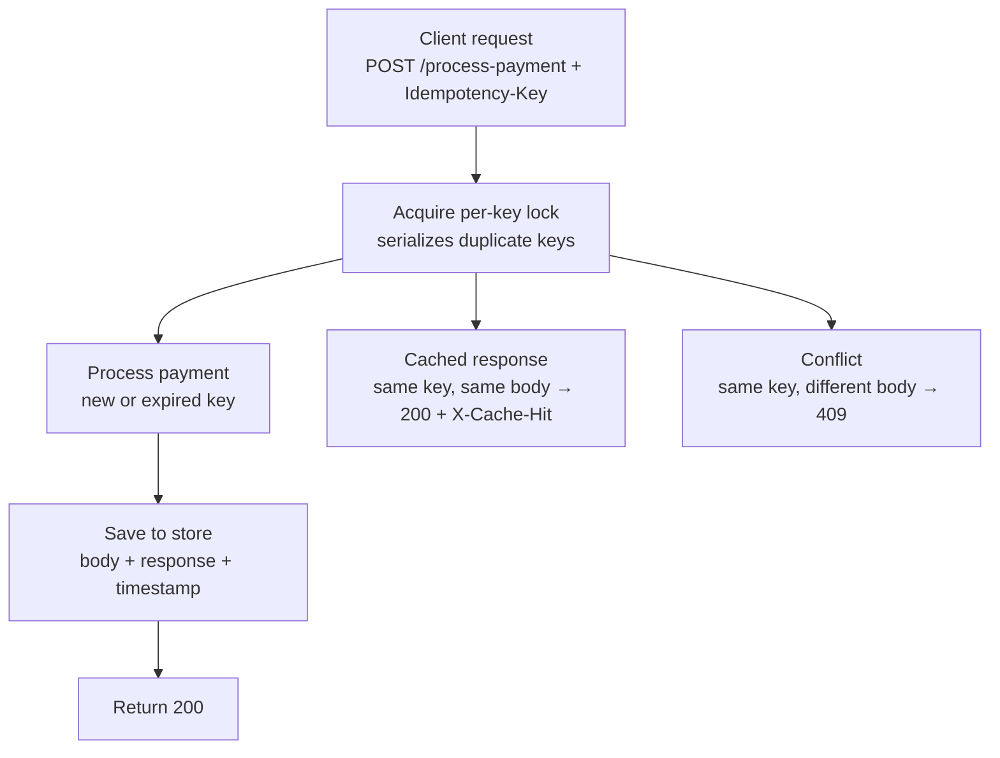

# Idempotency-Gateway — "Pay-Once" Protocol

A FastAPI service that protects a payment endpoint from double-charging when a
client retries the same request (e.g. after a network timeout). Built for the
AmaliTech Backend Track "Pay-Once" challenge.

A client sends a unique `Idempotency-Key` header with every payment attempt.
If the same key shows up again with the same request body, the server returns
the original response instead of processing the payment a second time.

---

## Architecture Diagram



Every request first acquires a lock scoped to its own `Idempotency-Key`, so
requests with different keys never block each other, but two requests sharing
the *same* key are forced to take turns. Whichever request holds the lock
checks whether that key has been seen before (and hasn't expired), then takes
exactly one of three paths: process it fresh, return the cached result, or
reject it as a conflict.

---

## Setup Instructions

```bash
git clone <your-fork-url>
cd Idempotency-gateway

python3 -m venv venv
source venv/bin/activate        # on Windows: venv\Scripts\activate

pip install -r requirements.txt

# optional — copy the example env file and adjust if you want a non-default TTL
cp .env.example .env

uvicorn app.main:app --reload
```

The server starts at `http://127.0.0.1:8000`. Interactive API docs (Swagger
UI) are generated automatically at `http://127.0.0.1:8000/docs`.

Run the automated test suite:

```bash
pytest tests/test_payments.py -v
```

---

## API Documentation

### `GET /`

Health check.

**Response — `200 OK`**

```json
{"status": "ok"}
```

### `POST /process-payment`

| | |
|---|---|
| **Header** | `Idempotency-Key: <unique-string>` (required) |
| **Body** | `{"amount": <number>, "currency": <string>}` |

**Example 1 — first request (happy path)**

```bash
curl -i -X POST http://127.0.0.1:8000/process-payment \
  -H 'Idempotency-Key: order-123' \
  -H 'Content-Type: application/json' \
  -d '{"amount": 100, "currency": "GHS"}'
```

```
HTTP/1.1 200 OK
content-type: application/json

{"message": "Charged 100 GHS"}
```

**Example 2 — repeat with the same key + same body (cache hit)**

```bash
curl -i -X POST http://127.0.0.1:8000/process-payment \
  -H 'Idempotency-Key: order-123' \
  -H 'Content-Type: application/json' \
  -d '{"amount": 100, "currency": "GHS"}'
```

```
HTTP/1.1 200 OK
x-cache-hit: true
content-type: application/json

{"message": "Charged 100 GHS"}
```

**Example 3 — repeat with the same key + a different body (conflict)**

```bash
curl -i -X POST http://127.0.0.1:8000/process-payment \
  -H 'Idempotency-Key: order-123' \
  -H 'Content-Type: application/json' \
  -d '{"amount": 500, "currency": "GHS"}'
```

```
HTTP/1.1 409 Conflict
content-type: application/json

{"detail": "Idempotency key already used for a different request body."}
```

**Example 4 — invalid body (automatic validation via Pydantic)**

```bash
curl -i -X POST http://127.0.0.1:8000/process-payment \
  -H 'Idempotency-Key: order-456' \
  -H 'Content-Type: application/json' \
  -d '{"amount": "banana", "currency": "GHS"}'
```

```
HTTP/1.1 422 Unprocessable Entity
```

---

## Design Decisions

**In-memory store instead of Redis or a database.** A plain Python
dictionary, guarded by per-key locks, is enough to demonstrate the
idempotency logic for this challenge. It's wiped on every restart — a real
production system would back this with Redis (which has native TTL support)
or a database row with a unique constraint on the idempotency key, so the
cache survives restarts and is shared across multiple server instances.

**Idempotency check lives in route logic, not literal FastAPI middleware.**
The brief describes this as a "middleware service," but it's implemented as
logic inside the `/process-payment` route itself, backed by a small
`IdempotencyStore` class. This was a deliberate trade-off: real ASGI
middleware runs for every request regardless of route, and intercepting +
comparing the request body from middleware means reading the body stream
before the route ever sees it — an easy way to introduce subtle bugs. Keeping
the check in the route keeps the order of operations (lock → check →
process/return) visible in one place and easy to step through.

**Per-key locking instead of one global lock.** Each idempotency key gets its
own `threading.Lock`, created lazily the first time that key is seen. Requests
with different keys process fully in parallel; only requests sharing the
*same* key serialize against each other. A single global lock would have been
simpler to write, but would make every payment request — even completely
unrelated ones — wait on every other in-flight request, which defeats the
purpose of the API.

**Pydantic schemas for validation.** `PaymentRequest`/`PaymentResponse`
define the exact shape of the request and response bodies. Invalid input
(wrong types, missing fields) is rejected automatically with a `422` before
any business logic runs, and FastAPI uses the same schemas to generate the
Swagger docs at `/docs` for free.

**Response message formatting.** `amount` is a `float`, so naively
interpolating it into a string would print `"Charged 100.0 GHS"` for whole
numbers. The route formats it with Python's `:g` format spec instead, which
strips the trailing `.0` for whole numbers while still showing real decimals
(`99.99` stays `99.99`) — matching the brief's exact expected wording.

---

## The Developer's Choice: TTL Expiry on Idempotency Keys

**What it is.** Every saved idempotency key now expires after a configurable
number of seconds (`IDEMPOTENCY_KEY_TTL_SECONDS`, default `86400` — 24 hours,
the same window Stripe uses for its idempotency keys). Once a key is looked
up past its TTL, it's treated as if it had never existed: the next request
with that key reprocesses from scratch, rather than returning a stale cached
response or incorrectly flagging a conflict against an old payload.

**Why it matters for a real fintech.** Without expiry, the store grows
forever, and a client could in principle resend a years-old idempotency key
and get back a payment confirmation for a transaction that, in any reasonable
business sense, has nothing to do with "now." A TTL bounds both the memory
footprint and the *meaning* of a cache hit — "this exact request, recently" —
rather than "this exact request, ever."

**Configuration.** The TTL is read from an environment variable, loaded via
`python-dotenv` from an optional `.env` file, falling back to the 24-hour
default if no `.env` is present (see `.env.example`). No secrets are
involved here — `.env` simply keeps local configuration out of version
control as a matter of convention, not because the TTL value itself is
sensitive.

---

## Known Limitations

- The in-memory store (and its locks) are wiped on every server restart and
  aren't shared across multiple server processes — acceptable for this
  challenge, but a real deployment would need Redis or a database.
- Per-key locks are created lazily and never removed, so a long-running
  deployment would see the internal locks dictionary grow slowly over time
  even after the keys themselves expire. A production version would
  periodically clean up locks for expired/evicted keys.